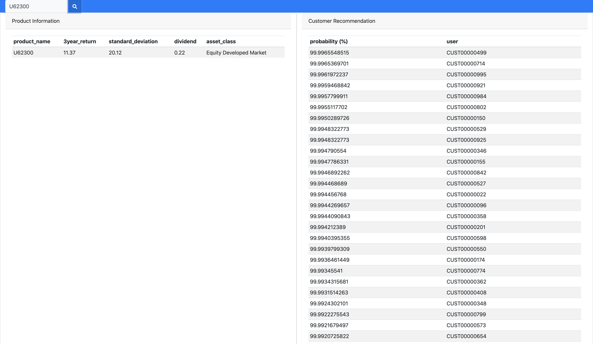

# financial-product-recommendation-system-sales-portal

This is a sample sales portal project demonstraing how to improve sales by leveraging Recommendation System 

## Backend Server
If you want to get hold of the latest Backend please visit [Financial Product Recommendation System](https://github.com/OneDodge/financial-product-recommendation-system)

## Sales Portal By Customer Configuration
Before you begin, please update the Sales Portal By Customer configuration (./sales-portal-by-customer.html) <br/>
If you are using default endpoint then you do not need to update this config
```
line 57: url = "http://localhost:5000/recommendation/data"
line167: http://localhost:5000/recommendation/product
```

## Sales Portal By Product Configuration
Before you begin, please update the Sales Portal By Product configuration (./sales-portal-by-product.html) <br/>
If you are using default endpoint then you do not need to update this config
```
line 54: url = "http://localhost:5000/recommendation/data"
line 131: http://localhost:5000/recommendation/user
```

## Layout
### Sales Portal By Customer


### Sales Portal By Product

